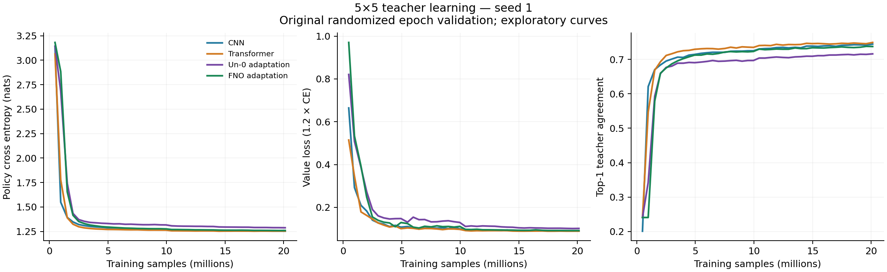

# Fourier neural operator 5x5 pilot: seed 1

One architecture, one seed, 20,123,648 training samples. The final checkpoint was fixed in advance; no hyperparameter sweep or endpoint selection.

This FNO configuration trails the CNN and transformer on final policy and value loss in both validation sets. It improves on the Un-0 adaptation on both losses in both sets. This one-seed comparison does not establish a general ranking of architecture families.

## Final fixed validation

All four final raw checkpoints were evaluated together: fp32, full history, all 63,000 rows, mean loss over eight D4 transformations. Lower losses are better; top-1 measures agreement with the teacher, not perfect play.

| Model | Parameters | Policy CE ↓ | Value loss ↓ | Top-1 ↑ | Policy KL ↓ |
|---|---:|---:|---:|---:|---:|
| CNN | 1,935,298 | 1.25206 | 0.08795 | 0.74404 | 0.21316 |
| Transformer | 1,376,301 | 1.25319 | 0.08778 | 0.74816 | 0.21429 |
| Un-0 adaptation | 1,720,987 | 1.28731 | 0.10078 | 0.71641 | 0.24840 |
| FNO adaptation | 1,976,626 | 1.25905 | 0.09050 | 0.73757 | 0.22015 |

FNO minus reference (positive loss differences are worse):

- CNN: policy CE +0.00699; value loss +0.00255; top-1 -0.65 percentage points.
- Transformer: policy CE +0.00586; value loss +0.00272; top-1 -1.06 percentage points.
- Un-0 adaptation: policy CE -0.02825; value loss -0.01028; top-1 +2.12 percentage points.

## Secondary subset without overlap

The existing audit found 115 shared games and 17,853 validation rows matching a training input under D4. This subset retains 44,514 rows without shared games or full inputs. It was fixed before this run, but after prior studies, and is not an untouched test set. Removing repeated openings changes its distribution.

| Model | Policy CE ↓ | Value loss ↓ | Top-1 ↑ | Policy KL ↓ |
|---|---:|---:|---:|---:|
| CNN | 1.27635 | 0.10140 | 0.74607 | 0.20388 |
| Transformer | 1.27899 | 0.10155 | 0.75070 | 0.20652 |
| Un-0 adaptation | 1.31955 | 0.11544 | 0.71284 | 0.24708 |
| FNO adaptation | 1.28496 | 0.10457 | 0.73828 | 0.21249 |

## Spectral-path intervention

First 2,048 validation rows, all eight symmetries. Disabling all five spectral paths at inference tests their contribution to this trained model; this is not a trained pointwise control.

| Condition | Policy CE | Value loss | Top-1 |
|---|---:|---:|---:|
| base | 1.25071 | 0.08114 | 0.73486 |
| spectral_off | 2.14480 | 0.66772 | 0.30298 |

## Learning curves and runtime

Curves use actual sample counts and the original randomized validation preprocessing. Use the fixed tables above for the endpoint comparison.

FNO training took 19.8 minutes. At full allocation of H100 + 8 CPU + 32 GiB, the training subprocess costs approximately $1.51 using [Modal list rates](https://modal.com/pricing) checked September 5, 2026. This includes training-loop validation and checkpoint writing, but excludes container startup, the short diagnostic, and final evaluation. This is an estimate, not a bill.

## Interpretation

This is a residual bottleneck FNO adaptation following [Li et al., including Anima Anandkumar](https://arxiv.org/abs/2010.08895v3). Its 1.98M parameters are close to the CNN but compute is not matched. One seed with one inherited Muon/LR recipe cannot establish training variance, significance, or a general architectural ranking. Resolution transfer, PDE-solving claims, and Go playing strength are not tested. There is no FNO Elo: the C++ search engine does not support this block.

See [frozen protocol](../../README.md), [raw evaluation](report.json), [launch specification](study.json), [execution record](launch.json), and [H100 diagnostic](diag/fno.txt).
