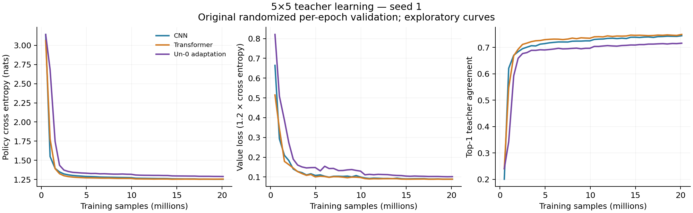

# Un-0-inspired 5x5 pilot: seed 1

One exploratory run, 20M nominal samples, existing teacher pool. Seed 2 was cancelled on user request shortly after launch and is excluded.

This configuration trails both references on final policy and value loss, including the subset without game/input overlap. One exploratory run does not establish an architectural advantage or a general limit of oscillator models.

## Fixed final validation

Final raw weights, fp32, full available history, all 63,000 rows and eight board symmetries. Losses are averaged across transformed examples, not across ensemble predictions. All three checkpoints were re-evaluated together.

| Model | Parameters | Samples | Policy CE ↓ | Value loss ↓ | Top-1 ↑ | Policy KL ↓ |
|---|---:|---:|---:|---:|---:|---:|
| CNN | 1,935,298 | 20,123,648 | 1.25206 | 0.08795 | 0.74404 | 0.21316 |
| Transformer | 1,376,301 | 20,123,648 | 1.25319 | 0.08778 | 0.74816 | 0.21429 |
| Un-0 adaptation | 1,720,987 | 20,123,648 | 1.28731 | 0.10078 | 0.71641 | 0.24840 |

Un-0 minus baseline (positive loss differences are worse):

- CNN: policy CE +0.03524; value loss +0.01283; top-1 -2.76 percentage points.
- Transformer: policy CE +0.03411; value loss +0.01300; top-1 -3.18 percentage points.

## Dataset audit and secondary subset

There are 115 games represented in both splits (849 validation rows). 14,081 validation rows have an exact training input; 17,853 match after board symmetry.

The following subset retains 44,514 rows whose game and full input (including all eight symmetries) are absent from training. It was defined after the overlap audit and is secondary. Excluding repeated openings changes the position distribution; this is not a fresh untouched test set.

| Model | Policy CE ↓ | Value loss ↓ | Top-1 ↑ | Policy KL ↓ |
|---|---:|---:|---:|---:|
| CNN | 1.27635 | 0.10140 | 0.74607 | 0.20388 |
| Transformer | 1.27899 | 0.10155 | 0.75070 | 0.20652 |
| Un-0 adaptation | 1.31955 | 0.11544 | 0.71284 | 0.24708 |

## Dynamics diagnostics

First 2,048 validation rows, all eight symmetries. These interventions were applied at inference to the trained model; they are not separately trained controls.

| Intervention | Policy CE | Value loss | Top-1 |
|---|---:|---:|---:|
| base | 1.27630 | 0.09216 | 0.71704 |
| double_steps | 1.28515 | 0.09609 | 0.71509 |
| coupling_off | 4.02036 | 4.23255 | 0.24005 |

## Learning curves and runtime

The curves retain the original randomized validation preprocessing; use the fixed table above for the final comparison. Curves use actual sample counts, not checkpoint indices.

Seed 1 training took 15.6 minutes. At the September 5, 2026 H100 + 8 CPU + 32 GiB list rates, this is approximately $1.19 at full resource allocation, excluding startup, diagnostic/evaluation jobs and the cancelled seed. This is an estimate, not an invoice.

## Interpretation limits

One seed measures neither training variance nor statistical significance. The adaptation has 1.72M parameters and a different trunk; it is not matched on compute, and no LR or solver sweep was run. The audited old pool has game/position overlap across its file split. These are teacher prediction metrics, not perfect-play accuracy or Elo. The next controls are trained no-coupling and tied-weight non-oscillatory models, followed by a genuinely held-out test and shared search evaluation.

See [protocol](../../README.md), [raw fixed evaluation](report.json), [launch record](launch.json), and [H100 diagnostic](diag/un0.txt).
